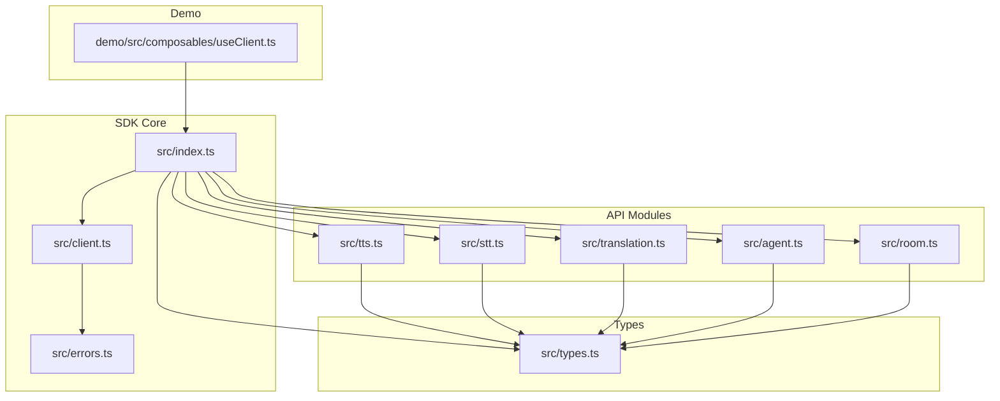
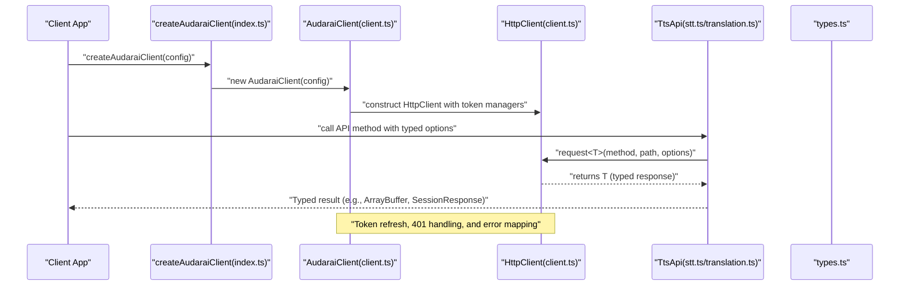
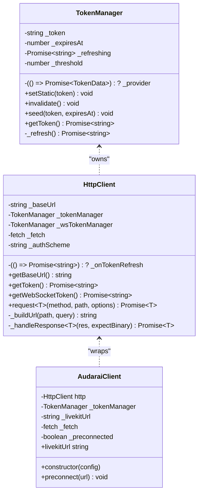
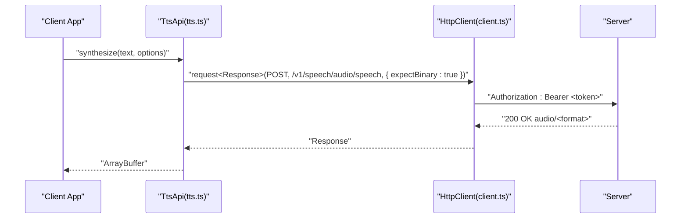
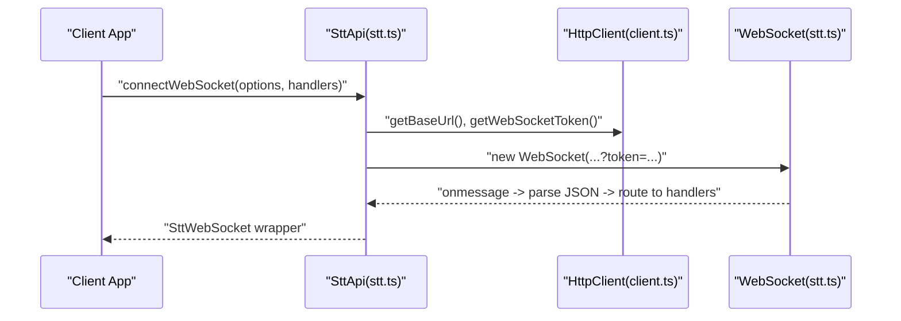
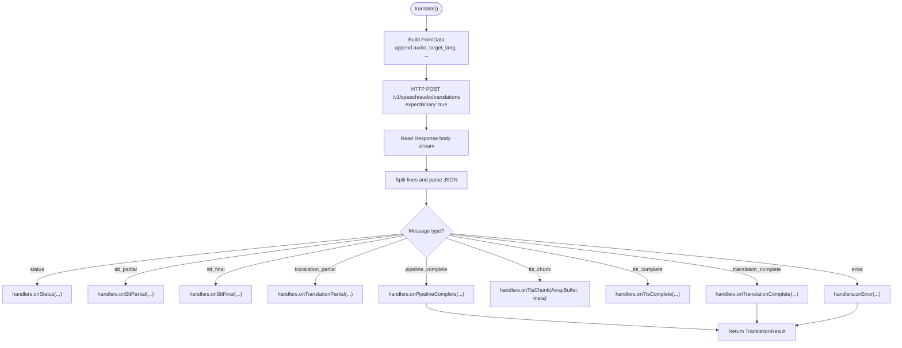
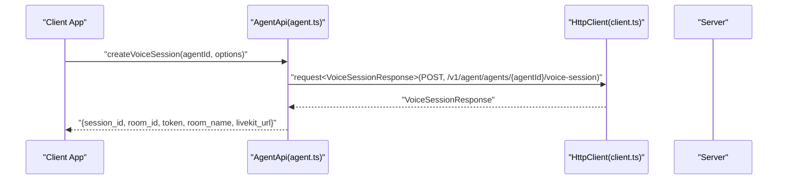
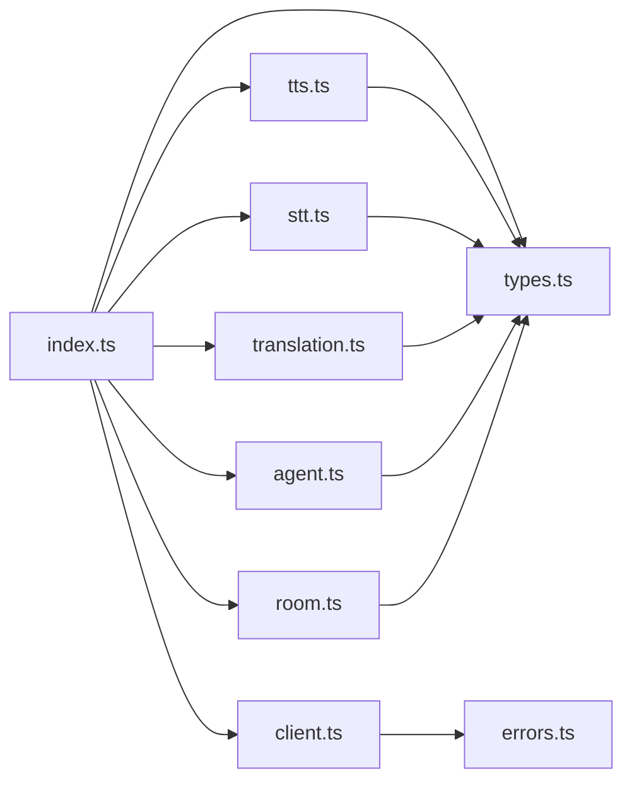

# TypeScript Integration

<cite>
**Referenced Files in This Document**
- [index.ts](file://src/index.ts)
- [types.ts](file://src/types.ts)
- [client.ts](file://src/client.ts)
- [tts.ts](file://src/tts.ts)
- [stt.ts](file://src/stt.ts)
- [translation.ts](file://src/translation.ts)
- [agent.ts](file://src/agent.ts)
- [room.ts](file://src/room.ts)
- [errors.ts](file://src/errors.ts)
- [useClient.ts](file://demo/src/composables/useClient.ts)
- [package.json](file://package.json)
- [tsconfig.json](file://tsconfig.json)
</cite>

## Table of Contents
1. [Introduction](#introduction)
2. [Project Structure](#project-structure)
3. [Core Components](#core-components)
4. [Architecture Overview](#architecture-overview)
5. [Detailed Component Analysis](#detailed-component-analysis)
6. [Dependency Analysis](#dependency-analysis)
7. [Performance Considerations](#performance-considerations)
8. [Troubleshooting Guide](#troubleshooting-guide)
9. [Conclusion](#conclusion)
10. [Appendices](#appendices)

## Introduction
This document provides comprehensive TypeScript integration guidance for the SDK, focusing on the complete type system, interface definitions, and type safety best practices. It documents all exported types, interfaces, enums, and generic types; explains type definitions for API responses, configuration objects, event handlers, and callback functions; and demonstrates practical usage patterns for type-safe API consumption. It also covers IDE integration, IntelliSense support, type checking configuration, advanced TypeScript features, and debugging techniques for type errors.

## Project Structure
The SDK is organized around a central client and modular APIs for TTS, STT, Translation, Agent, Room, and related resources. Types are centralized in a single module and re-exported via the main entry point. The demo showcases real-world usage patterns with Vue composables.

**Diagram sources**
- [index.ts:1-125](file://src/index.ts#L1-L125)
- [client.ts:1-411](file://src/client.ts#L1-L411)
- [tts.ts:1-231](file://src/tts.ts#L1-L231)
- [stt.ts:1-217](file://src/stt.ts#L1-L217)
- [translation.ts:1-277](file://src/translation.ts#L1-L277)
- [agent.ts:1-158](file://src/agent.ts#L1-L158)
- [room.ts:1-108](file://src/room.ts#L1-L108)
- [types.ts:1-1265](file://src/types.ts#L1-L1265)
- [useClient.ts:1-36](file://demo/src/composables/useClient.ts#L1-L36)

**Section sources**
- [index.ts:1-125](file://src/index.ts#L1-L125)
- [tsconfig.json:1-15](file://tsconfig.json#L1-L15)
- [package.json:1-26](file://package.json#L1-L26)

## Core Components
- Central client and HTTP layer:
  - AudaraiClient constructs and manages authentication modes, token providers, and preconnection logic.
  - HttpClient encapsulates request building, token injection, response handling, and error mapping.
- API modules:
  - TtsApi, SttApi, TranslationApi, AgentApi, RoomApi, and others provide strongly typed methods returning inferred types from the central HttpClient.
- Type system:
  - Centralized in types.ts with comprehensive interfaces for configuration, responses, streaming messages, and domain entities.
- Error types:
  - Distinct error classes for authentication, insufficient balance, rate limiting, and generic API errors.

Key exported types and interfaces are re-exported from the main entry point for convenient consumption.

**Section sources**
- [client.ts:215-411](file://src/client.ts#L215-L411)
- [tts.ts:11-231](file://src/tts.ts#L11-L231)
- [stt.ts:83-217](file://src/stt.ts#L83-L217)
- [translation.ts:111-277](file://src/translation.ts#L111-L277)
- [agent.ts:11-158](file://src/agent.ts#L11-L158)
- [room.ts:4-108](file://src/room.ts#L4-L108)
- [types.ts:1-1265](file://src/types.ts#L1-L1265)
- [errors.ts:1-43](file://src/errors.ts#L1-L43)
- [index.ts:18-125](file://src/index.ts#L18-L125)

## Architecture Overview
The SDK enforces type safety end-to-end: configuration objects feed typed requests; the HTTP client enforces response shapes; API classes return strongly typed results; and streaming handlers receive precisely typed messages.

**Diagram sources**
- [index.ts:160-192](file://src/index.ts#L160-L192)
- [client.ts:215-411](file://src/client.ts#L215-L411)
- [tts.ts:14-38](file://src/tts.ts#L14-L38)
- [stt.ts:92-102](file://src/stt.ts#L92-L102)
- [translation.ts:132-150](file://src/translation.ts#L132-L150)
- [types.ts:1-1265](file://src/types.ts#L1-L1265)

## Detailed Component Analysis

### Type System Overview
- Configuration:
  - AudaraiClientConfig defines authentication modes, token refresh hooks, and environment options.
- Speech synthesis (TTS):
  - SynthesizeOptions, ModelInfo, Speaker, VoiceMetadata, ListSpeakersResponse, SpeakerOperationResponse.
- Speech recognition (STT):
  - TranscribeOptions, TranscribeStreamOptions, TranscribeResult, TranscribeStreamChunk, TranscribeStreamHandlers, ConnectSttWebSocketOptions, SttMessage union, SttWebSocketHandlers.
- Translation:
  - TranslateOptions, TranslationResult, TranslateHandlers, ConnectTranslationWebSocketOptions, TranslationMessage union, TranslationWebSocketHandlers, SSE message types.
- Agent and Room:
  - AgentCreate, AgentUpdate, AgentResponse, AgentChatResponse, AgentVoicesResponse, VoiceSessionRequest, VoiceSessionResponse, RoomCreate, RoomUpdate, RoomResponse, RoomAddAgent, Session types, Message types, Tool types, Skill types, Archetype types, Channel types, Participant context types, Session actions types.
- Errors:
  - AudaraiError, AuthenticationError, InsufficientBalanceError, RateLimitedError, ApiError.

These types are exported from the main entry point and used across API methods and streaming handlers.

**Section sources**
- [types.ts:7-63](file://src/types.ts#L7-L63)
- [types.ts:128-151](file://src/types.ts#L128-L151)
- [types.ts:153-166](file://src/types.ts#L153-L166)
- [types.ts:170-188](file://src/types.ts#L170-L188)
- [types.ts:190-264](file://src/types.ts#L190-L264)
- [types.ts:429-448](file://src/types.ts#L429-L448)
- [types.ts:450-626](file://src/types.ts#L450-L626)
- [types.ts:673-796](file://src/types.ts#L673-L796)
- [types.ts:809-893](file://src/types.ts#L809-L893)
- [types.ts:895-931](file://src/types.ts#L895-L931)
- [types.ts:1007-1080](file://src/types.ts#L1007-L1080)
- [types.ts:1081-1110](file://src/types.ts#L1081-L1110)
- [types.ts:1111-1140](file://src/types.ts#L1111-L1140)
- [types.ts:1141-1160](file://src/types.ts#L1141-L1160)
- [types.ts:1161-1194](file://src/types.ts#L1161-L1194)
- [types.ts:1196-1232](file://src/types.ts#L1196-L1232)
- [types.ts:1234-1265](file://src/types.ts#L1234-L1265)
- [errors.ts:1-43](file://src/errors.ts#L1-L43)
- [index.ts:18-125](file://src/index.ts#L18-L125)

### Client and HTTP Layer
- Token management:
  - TokenManager seeds tokens, respects expiration thresholds, and refreshes tokens via provider callbacks.
  - HttpClient injects Authorization headers, handles 401 retries, maps HTTP statuses to typed errors, and decodes binary or JSON responses.
- Authentication modes:
  - Supports publishableKey, accessToken (JWT), apiKey, and appId/appSecret combinations with strict mutual exclusivity checks.
- Preconnection:
  - AudaraiClient optionally preconnects to LiveKit servers to reduce latency.

**Diagram sources**
- [client.ts:22-91](file://src/client.ts#L22-L91)
- [client.ts:93-213](file://src/client.ts#L93-L213)
- [client.ts:215-411](file://src/client.ts#L215-L411)

**Section sources**
- [client.ts:22-91](file://src/client.ts#L22-L91)
- [client.ts:93-213](file://src/client.ts#L93-L213)
- [client.ts:215-411](file://src/client.ts#L215-L411)

### TTS API
- Methods:
  - synthesize(text, options): returns ArrayBuffer.
  - synthesizeStream(text, options): returns Response for streaming.
  - listModels(), listSpeakers(), listSpeakersDetailed(modelName?), addSpeaker(name, audioFile, transcript, options), deleteSpeaker(name), updateSpeaker(name, patch), renameSpeaker(name, newName), replaceSpeakerAudio(name, audioFile, transcript), getSpeakerAudio(name): returns typed results.
- Options:
  - SynthesizeOptions controls provider, voice, model, response_format, speed, and generation parameters.

**Diagram sources**
- [tts.ts:14-38](file://src/tts.ts#L14-L38)
- [client.ts:133-173](file://src/client.ts#L133-L173)

**Section sources**
- [tts.ts:11-231](file://src/tts.ts#L11-L231)
- [types.ts:128-151](file://src/types.ts#L128-L151)

### STT API
- Methods:
  - listModels(), transcribe(audio, options): returns TranscribeResult.
  - transcribeStream(audio, options, handlers): parses SSE chunks and invokes handlers.
  - connectWebSocket(options, handlers): wraps WebSocket with typed message handling.
- Streaming:
  - TranscribeStreamChunk, TranscribeStreamHandlers, SttMessage union, SttWebSocketHandlers.

**Diagram sources**
- [stt.ts:198-215](file://src/stt.ts#L198-L215)
- [stt.ts:21-81](file://src/stt.ts#L21-L81)
- [client.ts:127-131](file://src/client.ts#L127-L131)

**Section sources**
- [stt.ts:83-217](file://src/stt.ts#L83-L217)
- [types.ts:170-188](file://src/types.ts#L170-L188)
- [types.ts:244-264](file://src/types.ts#L244-L264)

### Translation API
- Methods:
  - translate(audio, options, handlers): SSE pipeline with typed handlers.
  - connectWebSocket(options, handlers): WebSocket with typed message routing.
- Streaming:
  - TranslateHandlers, TranslationMessage union, TranslationWebSocketHandlers, SSE message types.

**Diagram sources**
- [translation.ts:132-228](file://src/translation.ts#L132-L228)
- [types.ts:327-346](file://src/types.ts#L327-L346)
- [types.ts:406-427](file://src/types.ts#L406-L427)

**Section sources**
- [translation.ts:111-277](file://src/translation.ts#L111-L277)
- [types.ts:268-346](file://src/types.ts#L268-L346)
- [types.ts:406-427](file://src/types.ts#L406-L427)

### Agent and Room APIs
- AgentApi:
  - CRUD agents, listAgentVoices, chat, createVoiceSession with typed payloads and responses.
- RoomApi:
  - CRUD rooms, generatePhases, manage agents, start sessions, list sessions.

**Diagram sources**
- [agent.ts:144-156](file://src/agent.ts#L144-L156)
- [types.ts:632-671](file://src/types.ts#L632-L671)

**Section sources**
- [agent.ts:11-158](file://src/agent.ts#L11-L158)
- [room.ts:4-108](file://src/room.ts#L4-L108)
- [types.ts:673-796](file://src/types.ts#L673-L796)
- [types.ts:809-893](file://src/types.ts#L809-L893)

### Practical Usage Patterns
- Creating a client:
  - Use createAudaraiClient with AudaraiClientConfig to configure authentication and environment.
- Type-safe API consumption:
  - Import specific types (e.g., SynthesizeOptions, TranscribeResult, AgentResponse) to annotate parameters and return values.
- Streaming handlers:
  - Implement handlers with precise argument types (e.g., TranscribeStreamChunk, TranslationSseTtsChunkMessage) to leverage IntelliSense and avoid runtime errors.
- Demo integration:
  - The demo composable demonstrates singleton client management and type assertion for convenience.

**Section sources**
- [index.ts:160-192](file://src/index.ts#L160-L192)
- [useClient.ts:21-35](file://demo/src/composables/useClient.ts#L21-L35)

## Dependency Analysis
- Export surface:
  - The main entry exports the client, factories, APIs, and all types for consumer convenience.
- Internal dependencies:
  - API modules depend on HttpClient and types.
  - Client depends on TokenManager and error types.
- Re-exports:
  - Types are re-exported from index.ts to provide a single import location.

**Diagram sources**
- [index.ts:1-125](file://src/index.ts#L1-L125)
- [client.ts:1-411](file://src/client.ts#L1-L411)
- [tts.ts:1-231](file://src/tts.ts#L1-L231)
- [stt.ts:1-217](file://src/stt.ts#L1-L217)
- [translation.ts:1-277](file://src/translation.ts#L1-L277)
- [agent.ts:1-158](file://src/agent.ts#L1-L158)
- [room.ts:1-108](file://src/room.ts#L1-L108)
- [types.ts:1-1265](file://src/types.ts#L1-L1265)
- [errors.ts:1-43](file://src/errors.ts#L1-L43)

**Section sources**
- [index.ts:1-125](file://src/index.ts#L1-L125)

## Performance Considerations
- Token refresh:
  - Proactive refresh before expiration reduces latency and avoids 401 storms.
- Preconnection:
  - AudaraiClient.preconnect leverages DNS and TLS preconnect hints to minimize LiveKit connection delays.
- Streaming:
  - Use streaming APIs (SSE/WebSocket) to process results incrementally and free buffers promptly.
- Binary responses:
  - ExpectBinary flag ensures efficient handling of audio streams without intermediate JSON parsing overhead.

[No sources needed since this section provides general guidance]

## Troubleshooting Guide
- Authentication failures:
  - AuthenticationError indicates missing or invalid credentials; verify configuration and token provider.
- Insufficient balance:
  - InsufficientBalanceError signals account credit issues; handle gracefully and prompt user action.
- Rate limiting:
  - RateLimitedError includes optional retry-after hint; back off and retry accordingly.
- Generic API errors:
  - ApiError carries HTTP status and code for diagnostics.
- Type errors:
  - Ensure imports match re-exports from the main entry; use exact property names and union literal types.
- IDE and type checking:
  - Enable strict mode and bundler module resolution; keep TypeScript version aligned with devDependencies.

**Section sources**
- [errors.ts:1-43](file://src/errors.ts#L1-L43)
- [client.ts:187-212](file://src/client.ts#L187-L212)
- [package.json:21-24](file://package.json#L21-L24)
- [tsconfig.json:2-12](file://tsconfig.json#L2-L12)

## Conclusion
The SDK’s type system provides strong guarantees across configuration, requests, responses, and streaming. By leveraging the exported types, implementing precise handlers, and following the provided patterns, developers can achieve robust, maintainable integrations with minimal runtime surprises. The architecture cleanly separates concerns, enabling safe extension and reuse across applications.

[No sources needed since this section summarizes without analyzing specific files]

## Appendices

### Type Safety Best Practices
- Prefer union literal types for constrained fields (e.g., response_format, provider).
- Use optional modifiers (?) for nullable or conditionally-present fields.
- Employ generics with HttpClient.request<T>() to enforce response shape.
- Keep handler signatures aligned with union message types to avoid runtime mismatches.
- Validate configuration objects at startup to surface misconfigurations early.

### IDE and Type Checking Configuration
- Compiler options:
  - Target ES2020, module ESNext, bundler resolution, strict mode, declaration emit, skipLibCheck, esModuleInterop.
- Package export map:
  - Types entry enables accurate IntelliSense for consumers.

**Section sources**
- [tsconfig.json:2-12](file://tsconfig.json#L2-L12)
- [package.json:7-14](file://package.json#L7-L14)