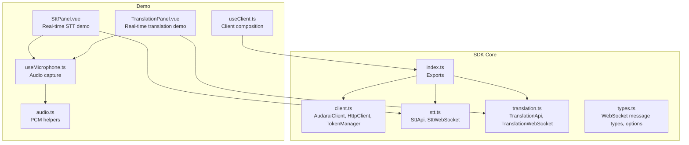
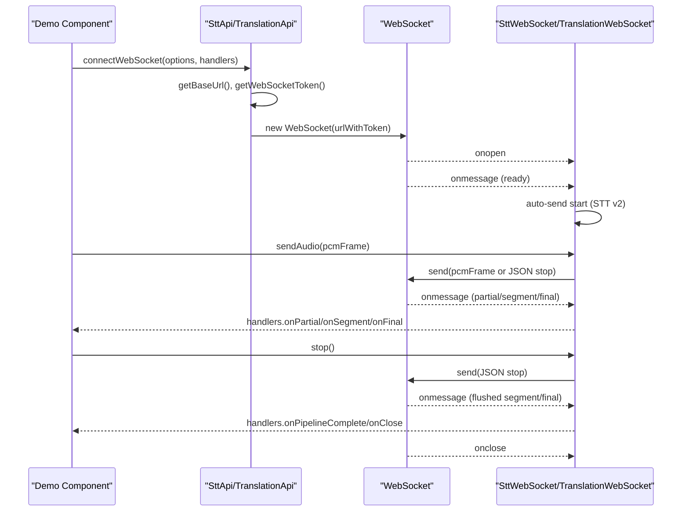
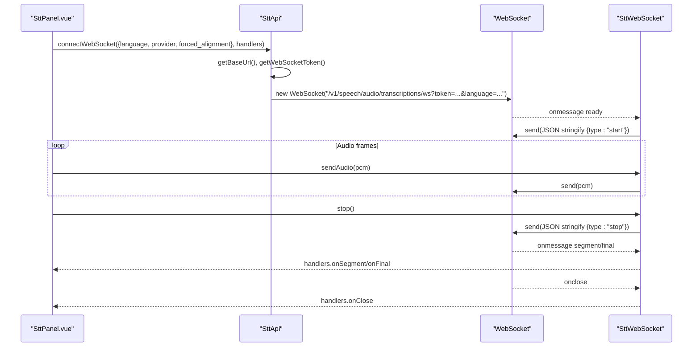
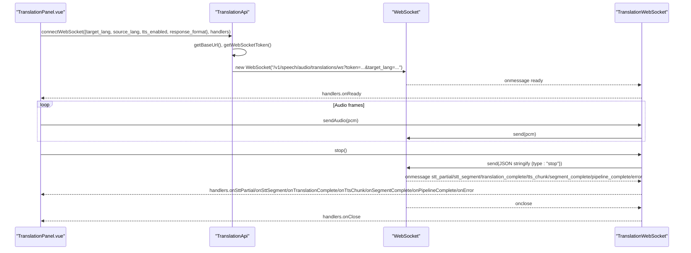
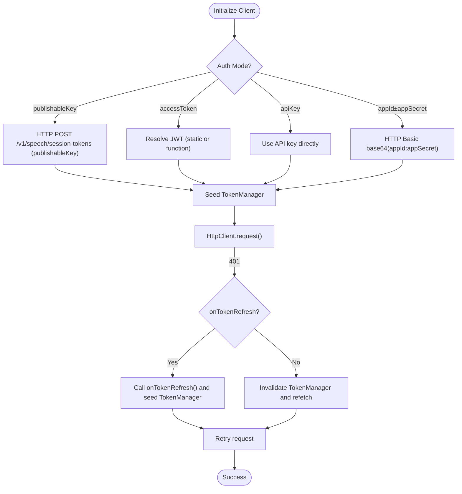
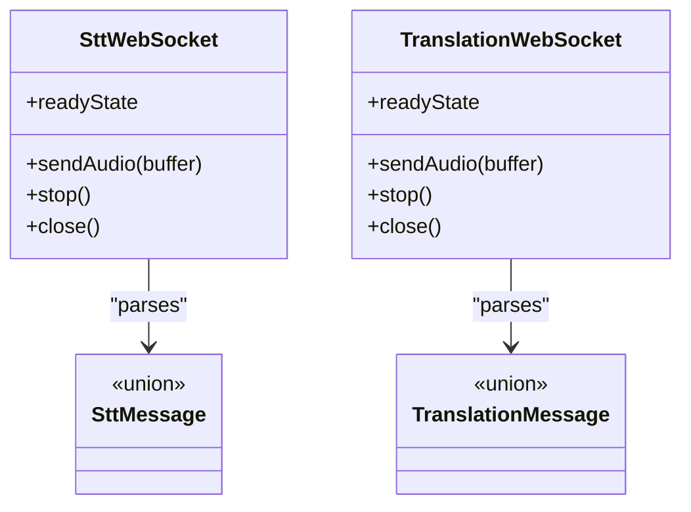
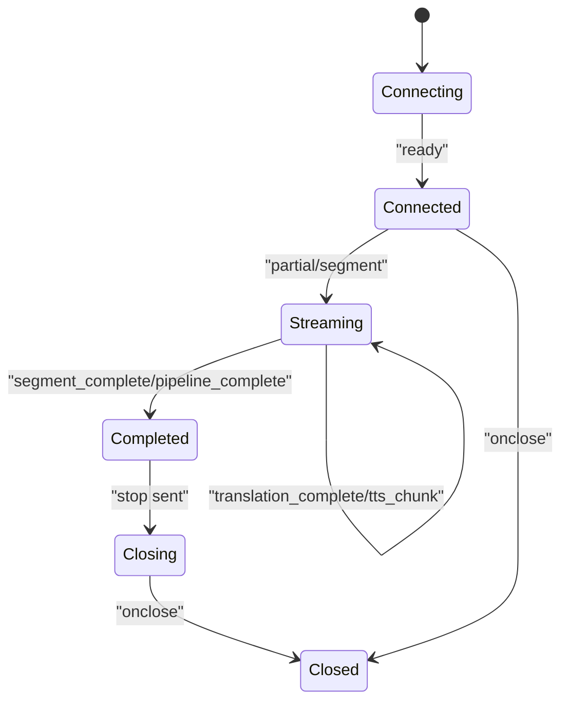
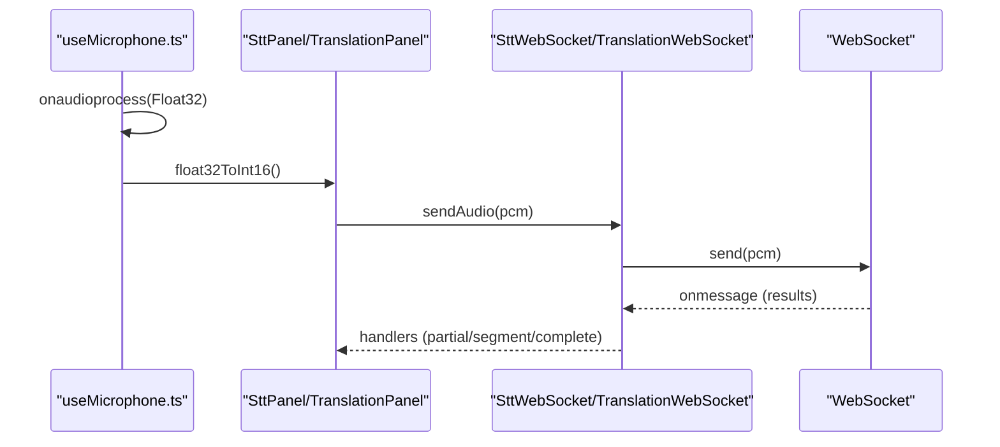
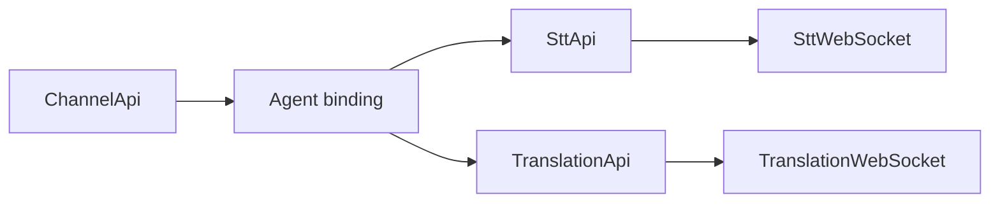
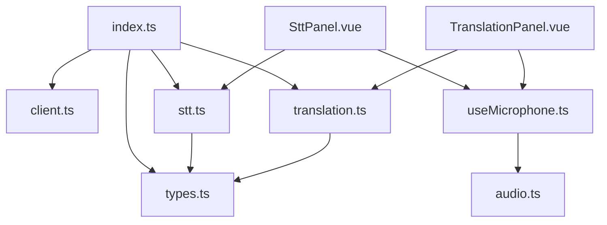

# WebSocket Integration

<cite>
**Referenced Files in This Document**
- [client.ts](file://src/client.ts)
- [stt.ts](file://src/stt.ts)
- [translation.ts](file://src/translation.ts)
- [types.ts](file://src/types.ts)
- [index.ts](file://src/index.ts)
- [useClient.ts](file://demo/src/composables/useClient.ts)
- [SttPanel.vue](file://demo/src/components/SttPanel.vue)
- [TranslationPanel.vue](file://demo/src/components/TranslationPanel.vue)
- [useMicrophone.ts](file://demo/src/composables/useMicrophone.ts)
- [audio.ts](file://demo/src/utils/audio.ts)
</cite>

## Table of Contents
1. [Introduction](#introduction)
2. [Project Structure](#project-structure)
3. [Core Components](#core-components)
4. [Architecture Overview](#architecture-overview)
5. [Detailed Component Analysis](#detailed-component-analysis)
6. [Dependency Analysis](#dependency-analysis)
7. [Performance Considerations](#performance-considerations)
8. [Troubleshooting Guide](#troubleshooting-guide)
9. [Conclusion](#conclusion)
10. [Appendices](#appendices)

## Introduction
This document explains the WebSocket integration for real-time audio streaming and messaging in the SDK. It covers connection establishment, message framing, event handling, lifecycle management, protocol implementation, and integration patterns with STT, translation, and channel communication services. It also documents security considerations, authentication integration, performance optimization, and practical debugging and monitoring techniques.

## Project Structure
The WebSocket integration spans several modules:
- Client and authentication: token management, HTTP client, and WebSocket token provisioning
- STT WebSocket: real-time speech-to-text streaming
- Translation WebSocket: end-to-end STT → translation → TTS pipeline over WebSocket
- Demo components: usage examples for microphone capture, real-time subtitle rendering, and audio playback
- Type definitions: protocol message schemas and configuration options

**Diagram sources**
- [client.ts:215-411](file://src/client.ts#L215-L411)
- [stt.ts:21-217](file://src/stt.ts#L21-L217)
- [translation.ts:39-277](file://src/translation.ts#L39-L277)
- [types.ts:190-448](file://src/types.ts#L190-L448)
- [index.ts:1-193](file://src/index.ts#L1-L193)
- [useClient.ts:1-36](file://demo/src/composables/useClient.ts#L1-L36)
- [SttPanel.vue:1-349](file://demo/src/components/SttPanel.vue#L1-L349)
- [TranslationPanel.vue:1-469](file://demo/src/components/TranslationPanel.vue#L1-L469)
- [useMicrophone.ts:1-45](file://demo/src/composables/useMicrophone.ts#L1-L45)
- [audio.ts:1-69](file://demo/src/utils/audio.ts#L1-L69)

**Section sources**
- [client.ts:215-411](file://src/client.ts#L215-L411)
- [stt.ts:21-217](file://src/stt.ts#L21-L217)
- [translation.ts:39-277](file://src/translation.ts#L39-L277)
- [types.ts:190-448](file://src/types.ts#L190-L448)
- [index.ts:1-193](file://src/index.ts#L1-L193)
- [useClient.ts:1-36](file://demo/src/composables/useClient.ts#L1-L36)
- [SttPanel.vue:1-349](file://demo/src/components/SttPanel.vue#L1-L349)
- [TranslationPanel.vue:1-469](file://demo/src/components/TranslationPanel.vue#L1-L469)
- [useMicrophone.ts:1-45](file://demo/src/composables/useMicrophone.ts#L1-L45)
- [audio.ts:1-69](file://demo/src/utils/audio.ts#L1-L69)

## Core Components
- TokenManager: manages JWT lifetimes and refresh cycles for HTTP and WebSocket tokens
- HttpClient: wraps fetch, injects Authorization headers, handles 401 retries, and exposes getWebSocketToken
- AudaraiClient: constructs token providers based on configuration, supports publishableKey, accessToken, apiKey, and appId/appSecret modes, and provides preconnect optimization
- SttWebSocket: wraps a WebSocket for STT v2 protocol, parses JSON messages, auto-sends start after ready, and forwards audio frames
- TranslationWebSocket: wraps a WebSocket for the STT → translation → TTS pipeline, decodes base64 audio chunks, and emits typed events
- Type definitions: SttMessage and TranslationMessage unions, plus handler interfaces for event-driven programming

Key responsibilities:
- Authentication: TokenManager and HttpClient coordinate token acquisition and refresh
- Protocol: SttWebSocket and TranslationWebSocket implement message framing and event routing
- Lifecycle: open → ready → streaming → stop flush → final/close
- Integration: demos show microphone capture, real-time subtitle rendering, and audio playback

**Section sources**
- [client.ts:22-91](file://src/client.ts#L22-L91)
- [client.ts:93-213](file://src/client.ts#L93-L213)
- [client.ts:215-411](file://src/client.ts#L215-L411)
- [stt.ts:21-81](file://src/stt.ts#L21-L81)
- [translation.ts:39-109](file://src/translation.ts#L39-L109)
- [types.ts:190-448](file://src/types.ts#L190-L448)

## Architecture Overview
The WebSocket integration follows a layered architecture:
- Application layer: demo components orchestrate microphone capture and UI updates
- API layer: SttApi and TranslationApi construct WebSocket URLs with tokens and query parameters
- Transport layer: SttWebSocket and TranslationWebSocket manage connection lifecycle and message routing
- Authentication layer: TokenManager and HttpClient provide tokens and handle refresh

**Diagram sources**
- [stt.ts:198-217](file://src/stt.ts#L198-L217)
- [translation.ts:258-277](file://src/translation.ts#L258-L277)
- [stt.ts:21-81](file://src/stt.ts#L21-L81)
- [translation.ts:39-109](file://src/translation.ts#L39-L109)

## Detailed Component Analysis

### STT WebSocket Integration
The STT WebSocket enables real-time speech-to-text streaming:
- Connection: build ws URL from HTTP base URL, append token and query parameters (provider, language, forced_alignment)
- Handshake: server sends ready; SDK auto-sends start
- Streaming: server emits partial, segment, and final messages
- Termination: client sends stop; server flushes and closes

**Diagram sources**
- [stt.ts:198-217](file://src/stt.ts#L198-L217)
- [stt.ts:21-81](file://src/stt.ts#L21-L81)
- [SttPanel.vue:144-234](file://demo/src/components/SttPanel.vue#L144-L234)

**Section sources**
- [stt.ts:21-81](file://src/stt.ts#L21-L81)
- [stt.ts:198-217](file://src/stt.ts#L198-L217)
- [SttPanel.vue:98-234](file://demo/src/components/SttPanel.vue#L98-L234)

### Translation WebSocket Integration
The Translation WebSocket integrates STT, translation, and TTS:
- Connection: build ws URL with token and query parameters (target_lang, source_lang, voice, translation_mode, tts_enabled, response_format)
- Streaming: server emits stt_partial, stt_segment, translation_complete, tts_chunk, segment_complete, pipeline_complete, error
- Audio handling: SDK decodes base64 audio to ArrayBuffer in onTtsChunk

**Diagram sources**
- [translation.ts:258-277](file://src/translation.ts#L258-L277)
- [translation.ts:39-109](file://src/translation.ts#L39-L109)
- [TranslationPanel.vue:156-270](file://demo/src/components/TranslationPanel.vue#L156-L270)

**Section sources**
- [translation.ts:39-109](file://src/translation.ts#L39-L109)
- [translation.ts:258-277](file://src/translation.ts#L258-L277)
- [TranslationPanel.vue:122-270](file://demo/src/components/TranslationPanel.vue#L122-L270)

### Token Management and Authentication
TokenManager and HttpClient coordinate authentication:
- TokenManager: caches tokens, respects refresh thresholds, prevents concurrent refresh, and seeds tokens from JWT expiration
- HttpClient: injects Authorization header, handles 401 by refreshing via onTokenRefresh or invalidating provider cache, and exposes getWebSocketToken
- AudaraiClient: supports four auth modes (publishableKey, accessToken, apiKey, appId±appSecret), provisions separate WebSocket token provider when needed, and preconnects to LiveKit

**Diagram sources**
- [client.ts:22-91](file://src/client.ts#L22-L91)
- [client.ts:93-213](file://src/client.ts#L93-L213)
- [client.ts:215-411](file://src/client.ts#L215-L411)

**Section sources**
- [client.ts:22-91](file://src/client.ts#L22-L91)
- [client.ts:93-213](file://src/client.ts#L93-L213)
- [client.ts:215-411](file://src/client.ts#L215-L411)

### Message Framing and Protocol Implementation
- STT WebSocket v2: JSON messages with type field; server sends ready, partial, segment, final; client auto-sends start after ready; stop flushes and closes
- Translation WebSocket: JSON messages with typed stages; audio chunks are base64-encoded and decoded to ArrayBuffer by the wrapper
- SSE alternatives: STT and Translation also offer server-sent event streaming for file-based processing

**Diagram sources**
- [stt.ts:21-81](file://src/stt.ts#L21-L81)
- [translation.ts:39-109](file://src/translation.ts#L39-L109)
- [types.ts:244-414](file://src/types.ts#L244-L414)

**Section sources**
- [stt.ts:21-81](file://src/stt.ts#L21-L81)
- [translation.ts:39-109](file://src/translation.ts#L39-L109)
- [types.ts:244-414](file://src/types.ts#L244-L414)

### Connection Lifecycle Management
- Open: WebSocket constructed with token and query parameters
- Ready: server indicates session readiness; STT auto-starts, Translation starts microphone
- Streaming: partial/segment/final or pipeline stages emitted
- Stop: client sends stop; server flushes buffered audio and emits completion messages
- Close: connection closed; handlers.onClose invoked

**Diagram sources**
- [stt.ts:21-81](file://src/stt.ts#L21-L81)
- [translation.ts:39-109](file://src/translation.ts#L39-L109)

**Section sources**
- [stt.ts:21-81](file://src/stt.ts#L21-L81)
- [translation.ts:39-109](file://src/translation.ts#L39-L109)

### Real-Time Audio Streaming Patterns
- Microphone capture: useMicrophone sets up AudioContext and ScriptProcessor, converts Float32 to 16-bit integers, and pushes PCM frames to the WebSocket wrapper
- Audio utilities: bufferToObjectUrl, concatBuffers, pcmToWav, and base64ToArrayBuffer support playback and concatenation
- Demo panels: SttPanel.vue and TranslationPanel.vue demonstrate real-time subtitle rendering and audio playback

**Diagram sources**
- [useMicrophone.ts:8-45](file://demo/src/composables/useMicrophone.ts#L8-L45)
- [audio.ts:28-69](file://demo/src/utils/audio.ts#L28-L69)
- [stt.ts:60-81](file://src/stt.ts#L60-L81)
- [translation.ts:88-109](file://src/translation.ts#L88-L109)

**Section sources**
- [useMicrophone.ts:8-45](file://demo/src/composables/useMicrophone.ts#L8-L45)
- [audio.ts:28-69](file://demo/src/utils/audio.ts#L28-L69)
- [stt.ts:60-81](file://src/stt.ts#L60-L81)
- [translation.ts:88-109](file://src/translation.ts#L88-L109)
- [SttPanel.vue:141-234](file://demo/src/components/SttPanel.vue#L141-L234)
- [TranslationPanel.vue:154-270](file://demo/src/components/TranslationPanel.vue#L154-L270)

### Integration Patterns with STT, Translation, and Channel Services
- STT: file transcription, SSE streaming, and WebSocket streaming
- Translation: file pipeline (SSE), WebSocket pipeline (STT → translation → TTS), and audio playback
- Channel: ChannelApi for CRUD operations on channels; STT/Translation integrate with channels via agent bindings and session configuration

**Diagram sources**
- [stt.ts:83-217](file://src/stt.ts#L83-L217)
- [translation.ts:111-277](file://src/translation.ts#L111-L277)
- [channel.ts:4-44](file://src/channel.ts#L4-L44)

**Section sources**
- [stt.ts:83-217](file://src/stt.ts#L83-L217)
- [translation.ts:111-277](file://src/translation.ts#L111-L277)
- [channel.ts:4-44](file://src/channel.ts#L4-L44)

## Dependency Analysis
The WebSocket integration depends on:
- Token management and HTTP client for authentication and URL construction
- Type definitions for message schemas and handler interfaces
- Demo utilities for audio conversion and playback

**Diagram sources**
- [index.ts:1-193](file://src/index.ts#L1-L193)
- [client.ts:215-411](file://src/client.ts#L215-L411)
- [stt.ts:21-217](file://src/stt.ts#L21-L217)
- [translation.ts:39-277](file://src/translation.ts#L39-L277)
- [types.ts:190-448](file://src/types.ts#L190-L448)
- [SttPanel.vue:1-349](file://demo/src/components/SttPanel.vue#L1-L349)
- [TranslationPanel.vue:1-469](file://demo/src/components/TranslationPanel.vue#L1-L469)
- [useMicrophone.ts:1-45](file://demo/src/composables/useMicrophone.ts#L1-L45)
- [audio.ts:1-69](file://demo/src/utils/audio.ts#L1-L69)

**Section sources**
- [index.ts:1-193](file://src/index.ts#L1-L193)
- [client.ts:215-411](file://src/client.ts#L215-L411)
- [stt.ts:21-217](file://src/stt.ts#L21-L217)
- [translation.ts:39-277](file://src/translation.ts#L39-L277)
- [types.ts:190-448](file://src/types.ts#L190-L448)
- [SttPanel.vue:1-349](file://demo/src/components/SttPanel.vue#L1-L349)
- [TranslationPanel.vue:1-469](file://demo/src/components/TranslationPanel.vue#L1-L469)
- [useMicrophone.ts:1-45](file://demo/src/composables/useMicrophone.ts#L1-L45)
- [audio.ts:1-69](file://demo/src/utils/audio.ts#L1-L69)

## Performance Considerations
- Token refresh threshold: adjust refreshThresholdSeconds to balance freshness and overhead
- Preconnect: AudaraiClient.preconnect optimizes DNS/TLS for LiveKit servers
- Audio frame size: ScriptProcessor buffer size affects latency; demo uses 4096 samples
- Forced alignment: enabling word timestamps increases CPU and bandwidth usage
- TTS format: choose appropriate response_format to minimize payload size
- SSE vs WebSocket: for file-based workflows, SSE reduces connection overhead; for continuous real-time streaming, WebSocket is preferred

[No sources needed since this section provides general guidance]

## Troubleshooting Guide
Common issues and remedies:
- Authentication failures (401): HttpClient retries with refreshed tokens; ensure onTokenRefresh is provided for accessToken mode
- WebSocket errors: check handlers.onError and handlers.onClose; verify token validity and network connectivity
- Audio quality: confirm microphone permissions, sample rate (16 kHz), and mono PCM format
- Pipeline stalls: monitor SSE/WS events; ensure stop is sent to flush remaining audio
- Token refresh mutex: TokenManager prevents concurrent refreshes; avoid manual token invalidation during refresh windows

**Section sources**
- [client.ts:121-173](file://src/client.ts#L121-L173)
- [stt.ts:27-58](file://src/stt.ts#L27-L58)
- [translation.ts:45-86](file://src/translation.ts#L45-L86)

## Conclusion
The SDK provides a robust, event-driven WebSocket integration for real-time audio processing, supporting STT, translation, and TTS workflows. It emphasizes secure token management, flexible authentication modes, and developer-friendly APIs with comprehensive type definitions and demo integrations.

[No sources needed since this section summarizes without analyzing specific files]

## Appendices

### Practical Examples Index
- STT WebSocket setup and handlers: [SttPanel.vue:144-234](file://demo/src/components/SttPanel.vue#L144-L234)
- Translation WebSocket setup and handlers: [TranslationPanel.vue:156-270](file://demo/src/components/TranslationPanel.vue#L156-L270)
- Microphone capture and PCM conversion: [useMicrophone.ts:8-45](file://demo/src/composables/useMicrophone.ts#L8-L45), [audio.ts:28-69](file://demo/src/utils/audio.ts#L28-L69)
- Client initialization and token configuration: [useClient.ts:21-35](file://demo/src/composables/useClient.ts#L21-L35), [index.ts:142-193](file://src/index.ts#L142-L193)

**Section sources**
- [SttPanel.vue:144-234](file://demo/src/components/SttPanel.vue#L144-L234)
- [TranslationPanel.vue:156-270](file://demo/src/components/TranslationPanel.vue#L156-L270)
- [useMicrophone.ts:8-45](file://demo/src/composables/useMicrophone.ts#L8-L45)
- [audio.ts:28-69](file://demo/src/utils/audio.ts#L28-L69)
- [useClient.ts:21-35](file://demo/src/composables/useClient.ts#L21-L35)
- [index.ts:142-193](file://src/index.ts#L142-L193)